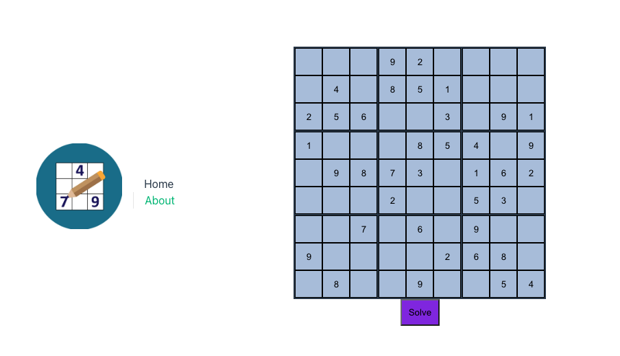

# Sudoku app
This repository contains a Sudoku app, which can be used to solve any Sudoku. The app consists of a Go backend (see: `./backend`) and a Vue.js frontend (see: `./frontend`).

The goal of this project was two-fold:
- Improving my Sudoku solving skills with a "hint" feature. So, if I'm stuck on a Sudoku, I could fill in the Sudoku in the app and get the next hint (instead of directly showing the end result like most other Sudoku apps out there).
- Getting some experience with building (modular) Go applications, especially because of my interest in the cloud native / Kubernetes ecosystem.

Currently, the Sudoku app can solve any Sudoku using various techniques. However, it does not yet support the "hint" feature mentioned before.



## Quick start
Run Docker Compose:

```bash
$ docker-compose up
```

The Sudoku app is now available on http://127.0.0.1:5000.

## Environments

|Environment|Frontend URL|Backend URL|
|---|---|---|
|Local Development|http://127.0.0.1:5173|http://127.0.0.1:8080|
|Docker Compose|http://127.0.0.1:5000|http://127.0.0.1:5001|
|Production|https://productionURL.com|https://productionURL.com/api|

## Credits
The application is inspired by https://www.sudoku-solutions.com/.
